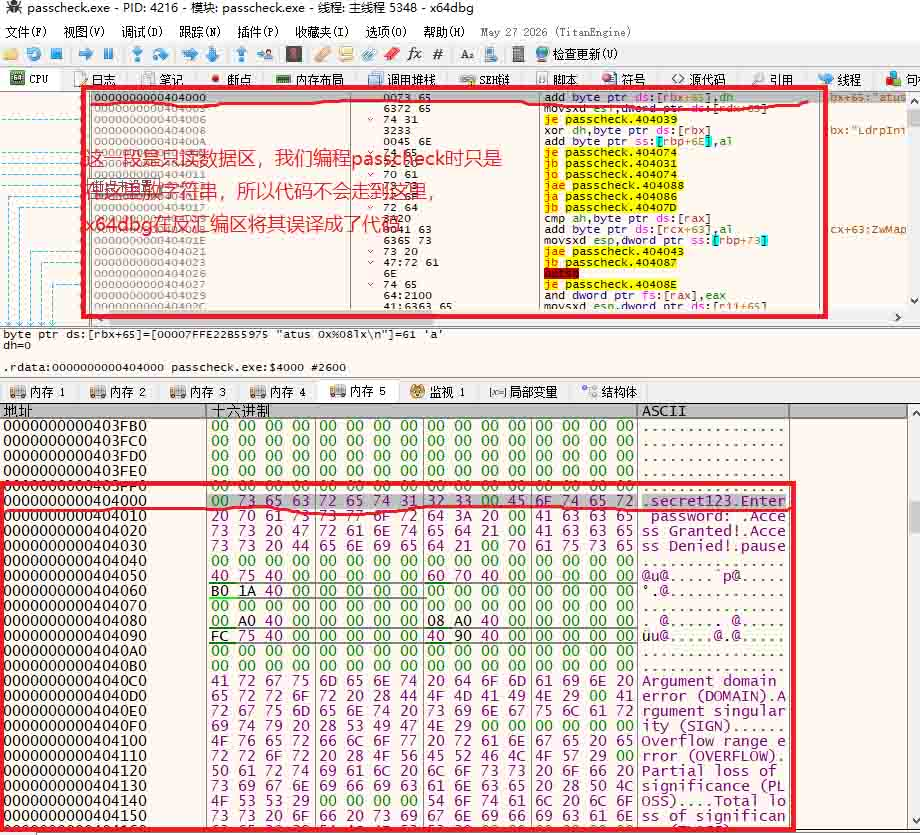

#### 1. 场景
在 x64dbg 中，我们导航到地址 `0000000000404000`，看到如下完全相反的两种呈现：

| 窗口 | 显示内容 | 解读 |
| :--- | :--- | :--- |
| **反汇编窗口** | `add byte ptr ds:[rbx+65],dh ` | 看起来是一条合法的 x64 指令 |
| **内存窗口（十六进制）** | `00 73 65 63 72 65 74 31 32 33 00 45 6E 74 65 72` | 原始字节流 |
| **内存窗口（右侧文本）** | `.secret123.Enter` | ASCII 编码的字符串 `"Enter pa"` |

**关键事实**：这两个窗口看的是**同一块物理内存**，地址都是 `0x404000`。为什么一个显示“指令”，一个显示“字符串”？

---

#### 2. 误译是如何发生的？（逐字节拆解）

x64dbg 的反汇编引擎是一个**纯数学解码器**。当它读取 `0x404000` 处的字节时，它完全不管这里是什么段、有没有执行权限，只管按 x64 指令表去套：

- 它读到的第一个字节是 `45`。
- 在 x64 指令集中，`45` 是一个 **REX 前缀**（作用是告诉 CPU “我要使用 `r13`、`r14` 这些 64 位扩展寄存器”）。
- 接着往下读第二个字节 `00`，结合前面的 REX 前缀，`00` 代表 `ADD` 指令。
- 再读第三个字节 `6E`，这是 **ModRM 字节**，它规定源操作数是 `r13b`（`r13` 的低 8 位），目标操作数是 `[r14]`（`r14` 寄存器指向的内存地址）。
- 最后读第四个字节 `00`，这是**偏移量/立即数**，值为 0。

于是，反汇编器就把这 4 个字节 `45 00 6E 00` 机械地翻译成了：`add byte ptr ds:[r14], r13b`

**然而真相是**：这 4 个字节在 UTF-16 编码下，`45 00` 代表字母 `'E'`，`6E 00` 代表字母 `'n'`。它们只是一个字符串的开头，跟汇编指令半毛钱关系都没有。

---

#### 3. 为什么 CPU 绝对不会执行这条“假指令”？

尽管反汇编窗口把它“翻译”出来了，但 CPU 永远不会按这个去执行，原因有两条硬性约束：

1. **PE 段的属性（权限）**：`0x404000` 是 `.rdata`（只读数据段）的起始地址。在 PE 文件头中，该段被标记为 **`IMAGE_SCN_MEM_READ`**（只读），**没有** `IMAGE_SCN_MEM_EXECUTE`（可执行）标志。Windows 加载器会给这段内存设置 **DEP（数据执行保护）**，禁止 CPU 从这里取指。
2. **RIP 指向（控制流）**：程序启动时，RIP 指向 PE 头记录的入口点（Entry Point，通常在 `.text` 段）。程序运行中的所有 `call` 和 `jmp`，其目标地址都是编译器算好的，全部落在 `.text` 段范围内。**没有任何合法指令会跳转到 `0x404000`**。

> 如果你强行把 RIP 改成 `0x404000` 让其执行，CPU 会立即触发**访问违规异常（0xC0000005）**，进程直接崩溃。

---

#### 4. 本质：冯·诺依曼架构的“双面性”

这正是冯·诺依曼架构的核心特征：**指令和数据放在同一个线性地址空间里，存储单元本身不区分 0 和 1 代表什么，解释权完全交给访问者。**

- **CPU（硬件）**：靠 **RIP 寄存器** 决定当前取指地址。RIP 指向哪，哪就是指令。
- **x64dbg 反汇编器（软件）**：它是一个**无情的翻译机**。无论光标停在哪个地址，它都忠实地把那里的字节翻译成助记符。它**不会**去查 PE 头看段属性，也**不会**检查 RIP 是否指向这里。

因此，你在 `0x404000` 看到的 `add byte ptr ds:[rbx+65],dh`，本质上是反汇编器**误将 ASCII 字符串的字节码当成了机器码来翻译**，产生了一个“语法正确但语义荒谬”的假象。

---

#### 5. 实操黄金法则（如何避免被误导）

当你在 x64dbg 中看到一个地址显示为汇编代码时，按以下两步进行验证：

| 步骤 | 操作 | 判断依据 |
| :--- | :--- | :--- |
| **第一步（看段属性）** | 按 `Alt+M` 打开内存映射（Memory Map）窗口，找到 `0x404000` 所在行。 | 如果权限列显示 **`R`**（只读）且**无 `E`**（不可执行），则反汇编内容**必定是误译**，应切回内存窗口看字符串。 |
| **第二步（看 RIP）** | 看反汇编窗口左上角的 RIP 值，或者寄存器窗口。 | 只有当 **RIP == 当前地址** 时，反汇编窗口的内容才是 CPU 即将执行的**真实指令**；否则都只是“静态推测”。 |

**针对 `0x404000` 这个示例**：`Alt+M` 会明确显示该段为 `.rdata`，属性为 `R`，无 `E`。因此，这里显示的 `add byte ptr...` **100% 是反汇编器翻译数据产生的幻觉**，右键切换内存窗口为 Unicode 显示，就能看到它的真身——字符串 `"Enter pa..."`。