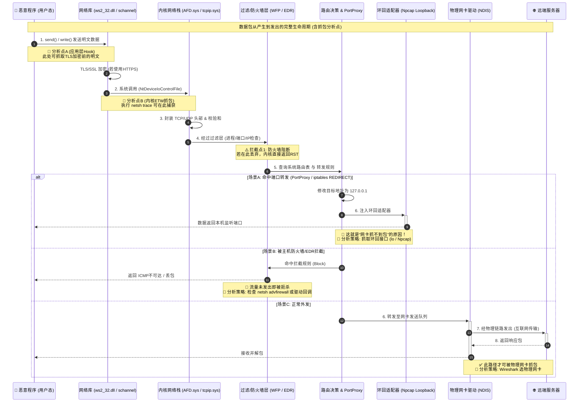

### 📊 时序图对应的分析策略指引

结合这张图，你之前的疑惑就有了清晰的答案：

1.  **关于“从网卡抓不到”**：
    - 如果流量命中了 **场景A（PortProxy）**，数据包在 `Route` 环节就被拐到了 `Loopback`（环回），根本不会进入 `NIC`（物理网卡）。所以你在 Wireshark 里选物理网卡抓包，自然什么都看不到。
    - **解决办法**：抓包时选择 **Npcap Loopback Adapter**（Windows）或 `lo` 接口（Linux）。

2.  **关于“抓包位置选哪里最优”**：
    - **想解密（看明文）**：选 **分析点A**（用户态）。在程序调用 `send()` 之后，TLS 加密之前，用 Frida 或 API Hook 勾住，直接看原始载荷。
    - **想抓完整网络层数据（看IP/TCP头）**：选 **分析点B**（内核态）。我们之前说的 `netsh trace` 就在这里生效，它能抓到绕过物理网卡的数据包。

3.  **关于“流量异常消失”**：
    - 如果程序既没走环回，也没过网卡，数据直接石沉大海，那就是命中了 **场景B（WFP/EDR拦截）**。这时候流量在内核态就被丢弃了，连 `netsh trace` 都可能看不到发往远端的包（只能看到丢弃日志）。

### 💡 实战操作建议（针对当前任务）

既然你已经运行了 `netsh trace` 抓取了 `.etl` 文件，根据这个时序图：

- 如果恶意程序用了 **场景A**（比如通过 `portproxy` 指向本地），你转换完 `.pcapng` 后，在 Wireshark 里看到的**源IP会是 127.0.0.1**。
- 如果它真的是要发往外网，只是被防火墙卡住了（**场景B**），那你转换出来的文件里可能只有 TCP SYN 包，没有后续的握手或数据载荷。

