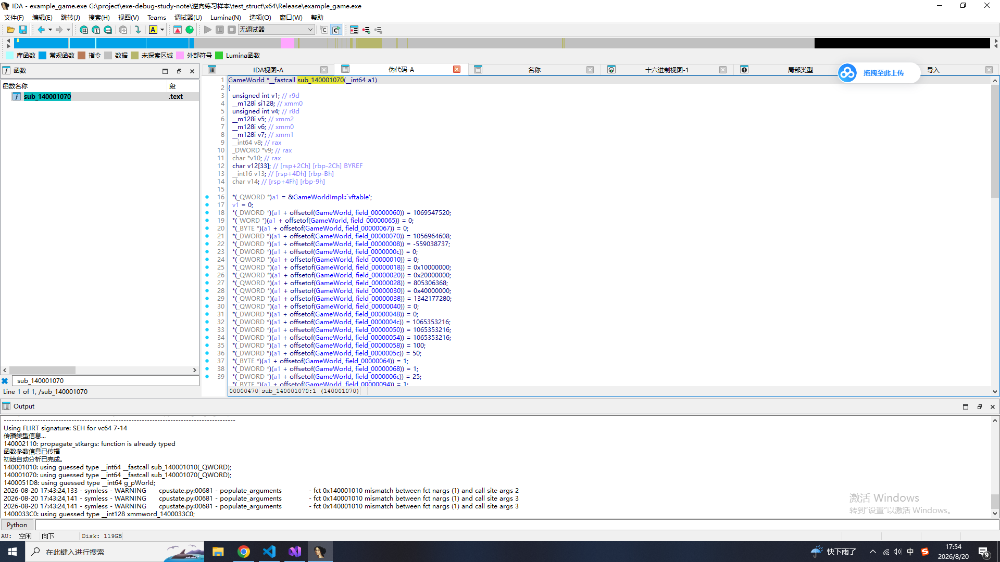
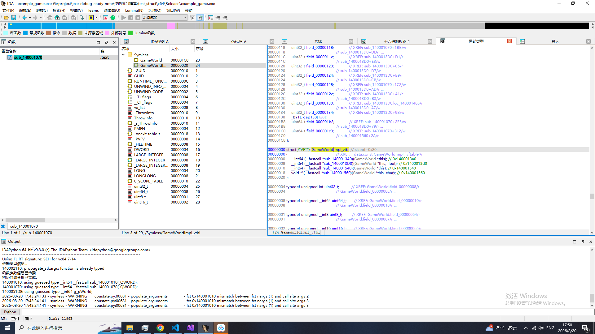

在 `example_game/main.cpp` 中定义了以下结构体：

```cpp
struct Vector3 {
    ...
};

struct PlayerStats {

};

struct WeaponInfo {
    ...
};

struct GameWorld {
    ...
};
```

使用 IDA Pro + Symless 插件 分析 `example_game.exe`:

1. 打开 IDA Pro 并加载 `example_game.exe` (不加载 pdb 文件)
2. 搜索名称 g_pWorld (因为方便展示, 它被改成导出符号, 所以有名称可被搜到)
3. 利用交叉引用找到构造函数


4. 使用 Symless 插件 分析构造函数

